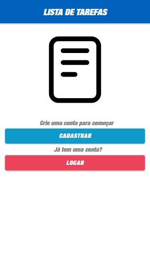
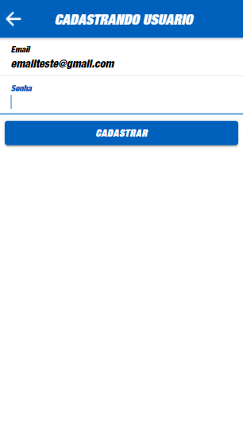
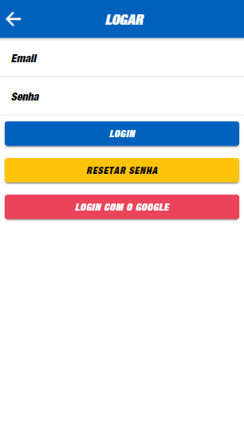
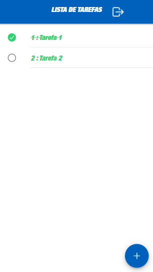

# Aplicativo-Lista-com-Autentiacao-Firebase
Aplicativo de lista de tarefas com opção de cadastro de conta

O principal intuito deste aplicativo foi aprimorar meus conhecimentos em autenticação através de firebase.

Para a realização deste aplicativo, segui um tutorial do site "https://www.positronx.io"

<h2>TELAS:</h2>

  Tela inicial:
   
   

  Tela de cadastro:
   
   

  Tela de ativação de conta:
   
   

  Tela de login:
   
   

  Tela de resetar senha:
   
   

  Menu de tarefas:
   
   

